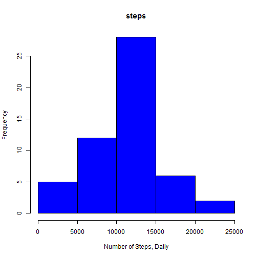
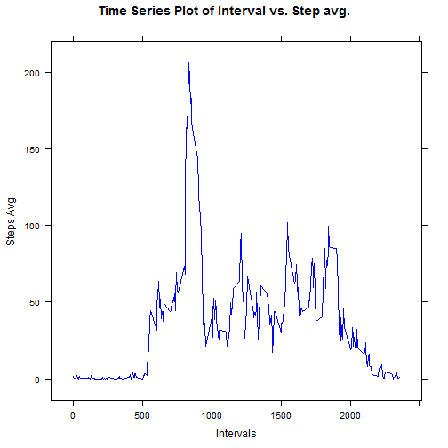
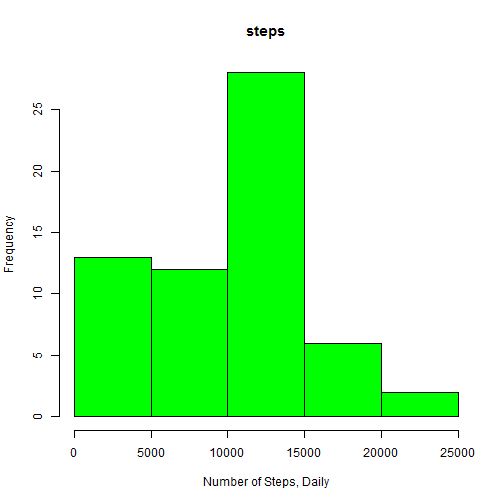
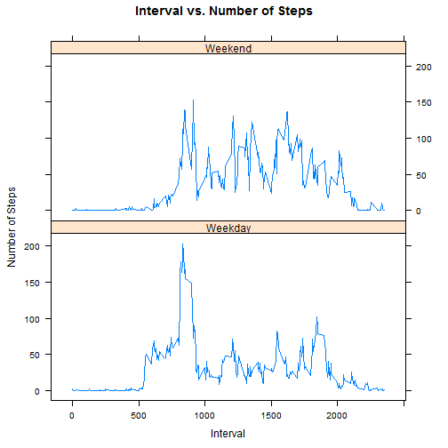

---
output:
  html_document:
    keep_md: yes
---
# Reproducible Research: Peer Assessment 1

###===========================================


This report will answer multiple questions, based on data from a personal
activity monitoring device. The device collected data at 5 minute intervals through out the day. The data consists of two months of data from an anonymous individual collected during the months of October and November, 2012 and include the number of steps taken in 5 minute intervals each day.

###===========================================
### Loading and preprocessing the data
###===========================================

We'll start by loading the data into R. Please make note that the file needs to be located in the working directory. We also reformat the data to allow processing.


```r
library(data.table)
```

```
## data.table 1.9.2  For help type: help("data.table")
```

```r
active_ds<-read.table("activity.csv", header=TRUE, sep=",", stringsAsFactors=FALSE)
active_ds$date <- as.Date(active_ds$date, format = "%Y-%m-%d")
active_ds[,c(1,3)]<- apply(active_ds[,c(1,3)], 2, function(x) as.numeric(x))
```


###===========================================
### What is mean total number of steps taken per day?
###===========================================

First we summarize number of steps per day, display a small sample of data for verification. And finally, create a histogram displaying the results.


```r
stepsbydate <- aggregate(steps ~ date, data=active_ds, FUN=sum, na.rm=TRUE)
hist(stepsbydate$steps, col = "blue", main = "steps", xlab="Number of Steps, Daily")
```

 

We now calculate and report the mean and median of total number of steps.


```r
mn<-mean(stepsbydate$steps)
md<-median(stepsbydate$steps)
```

**Mean** of total number of steps is = **1.0766 &times; 10<sup>4</sup>**. And **median** is = **1.0765 &times; 10<sup>4</sup>**.

###===========================================
###What is the average daily activity pattern?
###===========================================


This is a time series plot (i.e. type = "l") of the 5-minute interval (x-axis) and the average number of steps taken, averaged across all days (y-axis)


```r
library(lattice)
stepsbyinterval<-aggregate(steps ~ interval, data=active_ds, FUN=mean, na.rm=TRUE)
xyplot(steps~interval, data=stepsbyinterval, type="l", lwd=1, col="blue", ylab="Steps Avg.",
     xlab="Intervals", main="Time Series Plot of Interval vs. Step avg.")
```

 

```r
x<-stepsbyinterval[which.max(stepsbyinterval$steps),]$interval
s<-max(stepsbyinterval$steps)
```

Interval **835**, contains the maximum number of steps, which on average across all the days in the dataset, is **206.1698**.

###===========================================
### Imputting missing values
###===========================================

Note that there are a number of days/intervals where there are missing values (coded as NA). The presence of missing days may introduce bias into some calculations or summaries of the data.

First, to verify which columns contain missing values.


```r
names(active_ds)
```

```
## [1] "steps"    "date"     "interval"
```

```r
missing_s<-nrow(active_ds[is.na(active_ds$steps),])
missing_d<-nrow(active_ds[is.na(active_ds$date),])
missing_i<-nrow(active_ds[is.na(active_ds$interval),])
```
Only **steps** contain **2304** missing values. The other two columns have no NA's.


We'll create a new dataset, replacing missing values with mean for that day. If that date has no values, steps will be set to 0. 
    

```r
library(plyr)
complete_active<-(active_ds[!is.na(active_ds$steps),])
stepsmean_ds <- ddply(complete_active, c("date"), function(x) apply(x[1], 2, mean))
unique_date<-sort(unique(complete_active$date))
missing_filled_ds<-active_ds
ix<-0
for(i in 1:nrow(missing_filled_ds)){
    if(is.na(missing_filled_ds[i,]$steps)){
        compare_date<-missing_filled_ds[i,]$date
        missing_steps<-subset(stepsmean_ds, stepsmean_ds$date==compare_date)
        if (nrow(missing_steps)>0) {
        missing_filled_ds[i,]$steps<-subset(stepsmean_ds$steps, stepsmean_ds$date==compare_date)
        } else {
            missing_filled_ds[i,]$steps<-0
        } 
        
        ix=ix+1
    }
}

missing_s_new<-nrow(missing_filled_ds[is.na(missing_filled_ds$steps),])
print(ix)
```

```
## [1] 2304
```

```r
print(missing_s_new)
```

```
## [1] 0
```

**2304** values have been replaced. The count of rows with missing steps is now 
**0**.


We will now make a histogram of the total number of steps taken each day and calculate and report the mean and median total number of steps taken per day. 


```r
stepsbydate_missing <- aggregate(steps ~ date, data=missing_filled_ds, FUN=sum, na.rm=TRUE)
hist(stepsbydate_missing$steps, col = "green", main = "steps", xlab="Number of Steps, Daily")
```

 


```r
missing_mn<-mean(missing_filled_ds$steps)
missing_md<-median(missing_filled_ds$steps)
```

**Mean** of total number of steps is = **32.48**. And **median** is = **0**. 

As you can see, replacing the missing values with daily averages, changes the numbers drastically. 

###===========================================
## Are there differences in activity patterns between weekdays and weekends?
###===========================================


First we'll create a new factor variable in the dataset with two levels - "weekday" and "weekend" indicating whether a given date is a weekday or weekend day. And then we'll create a plot to compare the data. 


 

```r
weekday_ds<-missing_filled_ds
weekday_ds$wd <- weekdays(as.Date(weekday_ds$date))
weekday_ds$wd_sw <- weekdays(as.Date(weekday_ds$date))
wd<-c("Monday", "Tuesday", "Wednesday", "Thursday", "Friday")
for (i in 1:nrow(weekday_ds)){
    if (weekday_ds[i,]$wd %in% wd) {
        weekday_ds[i,]$wd_sw<-"Weekday"
    } else {
        weekday_ds[i,]$wd_sw<-"Weekend"
    }
}

wdsteps_ds_int <- ddply(weekday_ds, c("interval", "wd_sw"), function(x) apply(x[1], 2, mean))
xyplot(steps ~ interval | wd_sw, data=wdsteps_ds_int, type = "l", ylab = "Number of Steps", 
       xlab = "Interval", main = "Interval vs. Number of Steps", layout = c(1, 2))
```

 
=======
